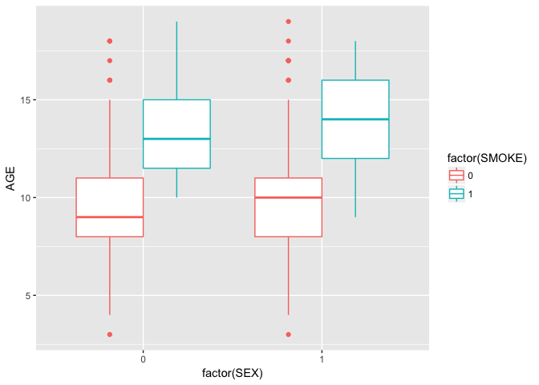
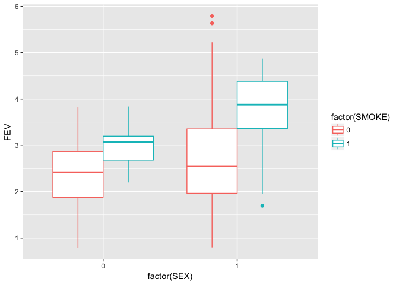

Causal Inference in Introductory Statistics Courses
===================================================

Below is a causal inference-based student activity using the forced expiratory volume (FEV) dataset originally published in Rosner (1995). Previously, Khan (2005) demonstrated how this data could be used in introductory courses to illustrate traditional statistical concepts. Here, we demonstrate how principles of casual inference can also be easily explained to introductory students using the same data. A student handout and instructor resources related to this activity are available on this site.

Thank you to my colleagues James Pleuss, Dusty Turner, Bryan Adams, Nicholas Clark, and Krista Watts for their assistance.

Background
----------

Today, it is common knowledge smoking has many negative health consequences. This was not always the case. The mass production and marketing of cigarettes following World War II led to a rapid increase in smoking rates, outpacing scientific and public health knowledge. Massive studies, with millions of participants, in the 1950s and 1960s led by the American Cancer Society established strong evidence connecting smoking to lung cancer. Subsequent studies, like the one this activity is based upon, sought to further refine this evidence. This activity is based on a study conducted in the 1970s. The researchers followed a cohort of children in East Boston, MA for seven years to determine, among other things, the effect of childhood smoking on lung function (Tager et al 1979, 1983).

Research Question
-----------------

What is the effect of teenage smoking on lung function?

Confounding Variables
---------------------

It would be unethical to conduct a randomized experiment of the effect of teenage smoking on lung function. Therefore, an observational study is necessary. In observational studies, the effect of one variable (the treatment) on another (the outcome) is subject to confounding. Confounding can occur when there are common causes of the variables. If we identify such variables, there are various things we can do in the study design and analysis to eliminate confounding.

What do you think are some confounders of the effect of teenage smoking on lung function?

Variables
---------

For the purposes of this activity, let's say you were able to control for all other potential confounding variables except subject age, sex, and height. Here is a list of variables we will consider. FEV is the outcome and SMOKE is the treatment.

| Variable | Description                                                     |
|----------|-----------------------------------------------------------------|
| AGE      | the age of the subject in years                                 |
| FEV      | forced expiratory volume (L), a common measure of lung function |
| HEIGHT   | the height of the subject in inches                             |
| SEX      | biological sex of the subject: Female (0), Male (1)             |
| SMOKE    | whether the subject had ever smoked or not: No (0), Yes (1)     |

Causal Diagram
--------------

A key component of causal inference is identifying potential confounding variables using expert knowledge, not the data.

The figure below is a causal diagram describing the variables in this study. An arrow from one variable to another indicates the first variable causes the second. These relationships are specified based on expert knowledge prior to collecting data. Here is a brief justification for the arrows originating from variables in this causal diagram.

-   Age. Older teenagers are more likely to smoke (more peers that smoke, greater freedom from parents, etc.), have higher lung capacity, and be taller.

-   Sex. Men are more likely to smoke than women, be taller, and have higher FEV (even when they are the same height as women).

-   Smoking. Childhood smoking can inhibits growth.

-   Height. Taller people have higher lung capacity.


Based on the backdoor path criterion, SEX and AGE are confounders in this causal diagram. Therefore, we should adjust for AGE and SEX in our analysis.

Data Analysis
-------------

``` r
library(tidyverse)

fev = read.table('http://jse.amstat.org/datasets/fev.dat.txt')
colnames(fev) = c("AGE", "FEV", "HEIGHT", "SEX", "SMOKE")
fev = as.tibble(fev)

#Summary Statistics
summary <- fev %>% group_by(SEX,SMOKE) %>% summarise_all(funs(mean,sd))
```

| SEX    |  SMOKE|  FEV (liters)|  stdev|  AGE (yrs)|  stdev|  HEIGHT (in)|  stdev|
|:-------|------:|-------------:|------:|----------:|------:|------------:|------:|
| FEMALE |      0|           2.4|    0.6|        9.4|    2.7|         59.6|    4.7|
| FEMALE |      1|           3.0|    0.4|       13.3|    2.2|         64.6|    2.3|
| MALE   |      0|           2.7|    1.0|        9.7|    2.8|         61.5|    6.3|
| MALE   |      1|           3.7|    0.9|       13.9|    2.5|         68.1|    3.2|

Smokers are older than nonsmokers.

``` r
fev %>% ggplot(aes(x = factor(SEX), y = AGE, color = factor(SMOKE))) + geom_boxplot()
```



Smokers have higher FEV than nonsmokers.

``` r
fev %>% ggplot(aes(x = factor(SEX), y = FEV, color = factor(SMOKE))) + geom_boxplot()
```



However, older teenagers have higher FEV.

``` r
fev %>% ggplot(aes(x = AGE, y = FEV, color = factor(SMOKE))) + geom_point()
```


### Unadjusted Analysis

In the unadjusted analysis, smoking is positively associated with lung function.

``` r
summary(lm(FEV ~ SMOKE, data = fev))
```

    ## 
    ## Call:
    ## lm(formula = FEV ~ SMOKE, data = fev)
    ## 
    ## Residuals:
    ##     Min      1Q  Median      3Q     Max 
    ## -1.7751 -0.6339 -0.1021  0.4804  3.2269 
    ## 
    ## Coefficients:
    ##             Estimate Std. Error t value Pr(>|t|)    
    ## (Intercept)  2.56614    0.03466  74.037  < 2e-16 ***
    ## SMOKE        0.71072    0.10994   6.464 1.99e-10 ***
    ## ---
    ## Signif. codes:  0 '***' 0.001 '**' 0.01 '*' 0.05 '.' 0.1 ' ' 1
    ## 
    ## Residual standard error: 0.8412 on 652 degrees of freedom
    ## Multiple R-squared:  0.06023,    Adjusted R-squared:  0.05879 
    ## F-statistic: 41.79 on 1 and 652 DF,  p-value: 1.993e-10

### Adjusted Analysis

We show two adjusted models (matching and regression). In both cases, there is no longer a beneficial effect of smoking on lung function.

#### Matching Model

In the matching model, we match smokers with all nonsmokers of the same AGE and SEX. Each AGE/SEX combination is called a subclass. Weights are assigned to each observation such that the total weight for both smokers and nonsmokers in each subclass is equal to one. Then, we compute the weighted least squares estimate for the parameter associated with FEV. We use the R MatchIt package for this analysis.

``` r
library(MatchIt)

#Perform matched and extract matched dataset and weights
match.exact = matchit(SMOKE ~ AGE + SEX, data = fev, method = "exact")
matched.data = match.data(match.exact)

#Fit weighted least squares regression model
model.matched = lm(FEV ~ SMOKE + SEX + AGE, data = matched.data, weights = weights)
summary(model.matched)
```

    ## 
    ## Call:
    ## lm(formula = FEV ~ SMOKE + SEX + AGE, data = matched.data, weights = weights)
    ## 
    ## Weighted Residuals:
    ##     Min      1Q  Median      3Q     Max 
    ## -2.0914 -0.3433 -0.1020  0.2722  2.8436 
    ## 
    ## Coefficients:
    ##             Estimate Std. Error t value Pr(>|t|)    
    ## (Intercept)  1.25193    0.17810   7.030 9.53e-12 ***
    ## SMOKE       -0.07114    0.07591  -0.937    0.349    
    ## SEX          0.78461    0.05836  13.444  < 2e-16 ***
    ## AGE          0.13239    0.01343   9.857  < 2e-16 ***
    ## ---
    ## Signif. codes:  0 '***' 0.001 '**' 0.01 '*' 0.05 '.' 0.1 ' ' 1
    ## 
    ## Residual standard error: 0.5515 on 384 degrees of freedom
    ## Multiple R-squared:  0.4813, Adjusted R-squared:  0.4773 
    ## F-statistic: 118.8 on 3 and 384 DF,  p-value: < 2.2e-16

#### Regression Model

``` r
model.regression = lm(FEV ~ SMOKE + AGE + SEX, data = fev)
summary(model.regression)
```

    ## 
    ## Call:
    ## lm(formula = FEV ~ SMOKE + AGE + SEX, data = fev)
    ## 
    ## Residuals:
    ##      Min       1Q   Median       3Q      Max 
    ## -1.46707 -0.35426 -0.03811  0.32199  1.94943 
    ## 
    ## Coefficients:
    ##              Estimate Std. Error t value Pr(>|t|)    
    ## (Intercept)  0.237771   0.080228   2.964  0.00315 ** 
    ## SMOKE       -0.153974   0.077977  -1.975  0.04873 *  
    ## AGE          0.226794   0.007884  28.765  < 2e-16 ***
    ## SEX          0.315273   0.042710   7.382  4.8e-13 ***
    ## ---
    ## Signif. codes:  0 '***' 0.001 '**' 0.01 '*' 0.05 '.' 0.1 ' ' 1
    ## 
    ## Residual standard error: 0.5432 on 650 degrees of freedom
    ## Multiple R-squared:  0.6093, Adjusted R-squared:  0.6075 
    ## F-statistic: 337.9 on 3 and 650 DF,  p-value: < 2.2e-16

References:

-   Kahn, M. (2005). An exhalent problem for teaching statistics.Journal of Statistics Education, 13(2).

-   Rosner, Bernard (1995). Fundamentals of Biostatistics. Duxbury Press: New York.

-   Tager, I. B., Weiss, S. T., Mu ̃noz, A., Rosner, B., and Speizer, F. E. (1983). Longitudinal study of the effects of maternal smoking on pulmonary function in children. New England Journal of Medicine, 309(12):699–703.

-   Tager, I. B., Weiss, S. T., Rosner, B., and Speizer, F. E. (1979). Effect of parental cigarette smoking on the pulmonary function of children. American Journal of Epidemiology, 110(1):15–26.

-   Ho, D. E., Imai, K., King, G., and Stuart, E. A. (2011). MatchIt: Nonparametric preprocessing for parametric causal inference.Journal of Statistical Software, 42(8):1–28.
